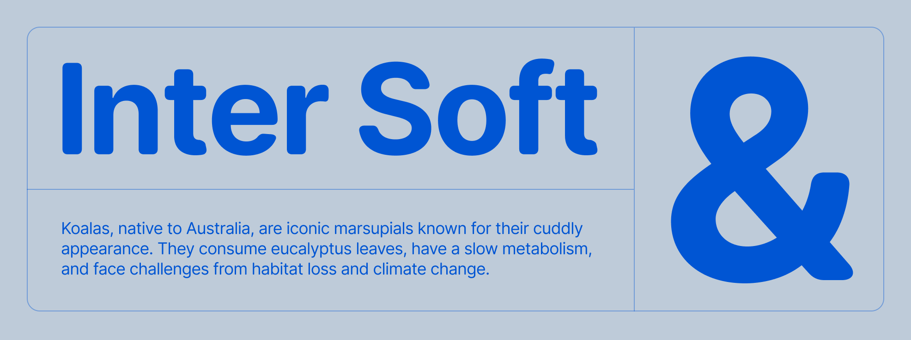

# Open Runde

Open Runde is a rounded variant of the typeface [Inter](https://github.com/rsms/inter) by [Rasmus Andersson](https://github.com/rsms).
The rounded corners are automatically generated by a tool called Glyphs Mini therefore some glyphs might not look perfect. (Feel free to open an issue for weird glyphs and I'll try to fix them)
Open Runde was originally created to be used in my app Superchat.

The typeface was initially called Inter Soft but was renamed to not conflict with the original Inter typeface and trademark.

[**Download Open Runde font files…**](https://github.com/lauridskern/open-runde/releases/latest)

 

## Questions
- Can you add more weights? -> Feel free to open an issue if you require a specific weight
- I found a weird looking glyhp -> Please open an issue and I'll try to fix it
- Can you make it a variable font? -> Probably not
- Can I legally use Inter for my purpose? -> Most likely yes! Inter is free and open source. ([Read the license](LICENSE.txt) for details.)

## Design

Open Runde was made entirely with the rounded corners tool of Glyphs Mini and is currently available in 4 different weights.

| Roman (upright) name | Weight
| -------------------- | ------------
| Regular              | 400
| Medium               | 500
| Semi Bold            | 600
| Bold                 | 700

