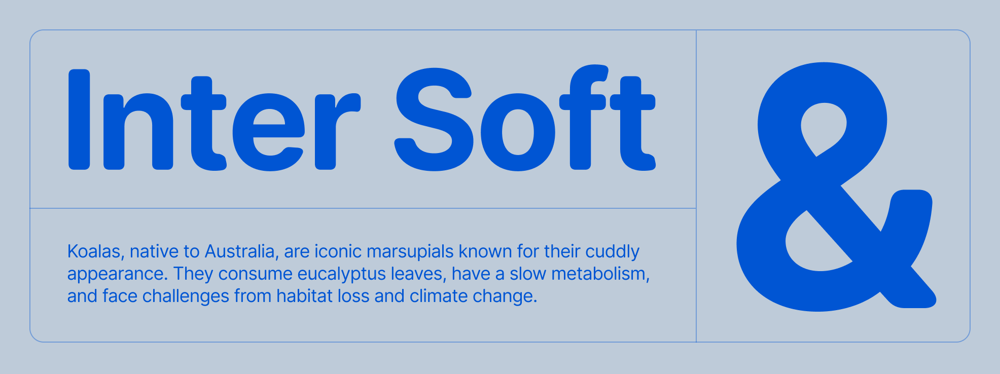

# Open Runde

Open Runde is a rounded variant of [Inter](https://github.com/rsms/inter),
designed by Rasmus Andersson. Open Runde applies an optically balanced,
geometry-driven rounding system developed by Laurids Kern.

The family was originally created for Superchat as an open alternative to
SF Pro Rounded. It was initially called Inter Soft and was renamed to avoid
confusion with the original Inter family and trademark.

[**Download the latest Open Runde release…**](https://github.com/lauridskern/open-runde/releases/latest)

 

## Family

Open Runde 2.0 contains nine weights, each with a true italic counterpart.

| Upright    | Italic            | Weight class |
| ---------- | ----------------- | -----------: |
| Thin       | Thin Italic       |          100 |
| ExtraLight | ExtraLight Italic |          200 |
| Light      | Light Italic      |          300 |
| Regular    | Italic            |          400 |
| Medium     | Medium Italic     |          500 |
| SemiBold   | SemiBold Italic   |          600 |
| Bold       | Bold Italic       |          700 |
| ExtraBold  | ExtraBold Italic  |          800 |
| Black      | Black Italic      |          900 |

Desktop TTF files are in [`src/desktop`](src/desktop). Matching WOFF2 files
and ready-to-use CSS are in [`src/web`](src/web). Individual release proofs

## Questions

- I found a weird-looking glyph -> Please open an issue and I'll try to fix it
- Can you make it a variable font? -> Playing around with but cannot promise anything
- Can I legally use Open Runde for my purpose? -> Most likely yes! Open Runde is free and open source. The license is the same as Inter's ([Read the license](LICENSE.txt) for details.)

## Design and source

Version 2.0 is rebuilt from the current Inter 4.001 variable sources at the
text optical size. Its corner radii scale with measured stem width and receive
small optical corrections at the lightest and heaviest weights. The rounding
pass protects counters, limits steep-corner radii, repairs subtly bowed long
edges, and fails closed when a proposed outline cannot pass geometry checks.

The release keeps Inter's glyph coverage, components, kerning, anchors, and
OpenType layout features. Build provenance and checksums are recorded in
[`src/export-manifest.json`](src/export-manifest.json); export details are in
[`src/BUILD.md`](src/BUILD.md).

## License

Open Runde is distributed under the SIL Open Font License 1.1, the same
license as Inter. See [`LICENSE.txt`](LICENSE.txt) and [`FONTLOG.txt`](FONTLOG.txt)
for copyright, attribution, and modification history.
